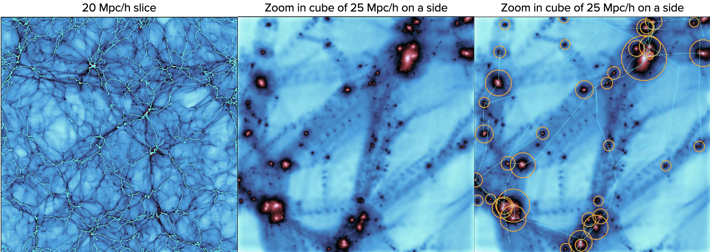

# pyFilConnect

  

[pyFilConnect](https://github.com/Blackholan/pyMWGCprogen) is a Python package which computes the filament connectivity at a given halo mass and then the connectivty slope and offset from halo catalogues and their associated cosmic skeletons extracted with the DisPerSE filament finder (papier disperse). We assess the robustness of the derived skeleton by DisPerSE by employing the rigorous method of calibration of Galárraga-Espinosa et al. (2020,2021, 2023b,a).

More details on the method and applications can be found in the paper:

[Distinguish dark matter theories with the cosmic web and next-generation surveys I: an alternative theory of gravity](https://arxiv.org/abs/2402.04837) [code paper]

The simulation data concerning the connectivity used in our study of Poisson and Monge-Ampère models are available [here](https://arxiv.org/abs/2402.04837)

### Usage

This repository contains: 

* read_dtfe_dev_v2.py, a python script that allows reading and writing DisPerSE files
* pyFilConnect.ipynb, a jupyter notebook that allows computing filament connectivity and its associated slope and offset. 
* /HaloMSM, a directory that contains halo catalogue at z=1 from a &Lambda;CDM DM-only cosmological simulation, as an example of data
* HaloGD512Z1.txt, DisPerSE initial condition file
* /DisPerSEoutput, a directory that contains in/outputs of DisPerSE code
* /CP, a directory that contains all the critical points for this z=1 snapshot
* /Filament, a directory that contains the filament end positions for this z=1 snapshot
* /Connectivity, a directory that contains the connectivity measurements of all simulated halos for this z=1 snapshot

## Authors

pyFilConnect is distributed under the MIT license. See [MIT License](https://en.wikipedia.org/wiki/MIT_License) for more details. 
If you use pyFilConnect in a publication, please cite the code paper [Boldrini & Laigle +24](https://arxiv.org/abs/2402.04837).

* [Pierre Boldrini](mailto:boldrini@iap.fr) -- Sorbonne University, Institut d'Astrophysique de Paris (IAP), France
* [Clotilde Laigle](mailto:laigle@iap.fr) -- Sorbonne University, Institut d'Astrophysique de Paris (IAP), France

